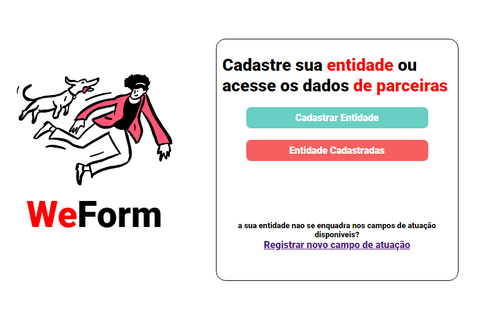

[CURSO SANTANDER CODERS 2023 ](hiltonesjr.github.io/Curso-Santander/)  

<h1> Ferramentas Usadas </h1>
<ul>

<li>HTML</li>
<li>CSS</li>
<li>GIT</li>
<li>Visual Code</li>
</ul>

<ul>

<li>Classes</li>
<li>Containers</li>
<li>Sections</li>
<li>Estilos de Fontes</li>
<li>Alinhamentos e Espaçamentos</li>
</ul>

Projeto de Realizadoss no Curso Santander Coders 2023 1° Etapa.
